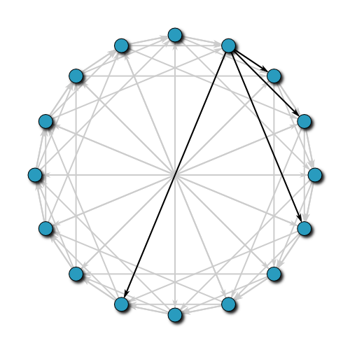
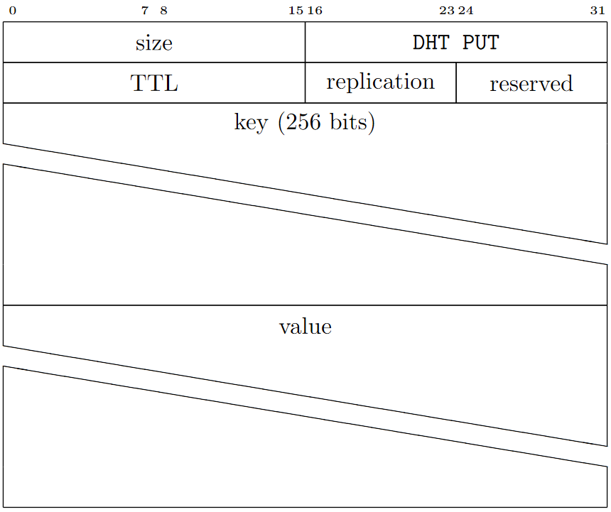
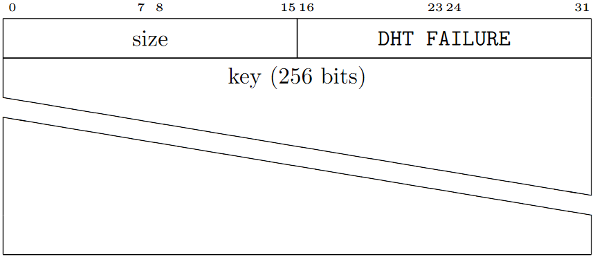
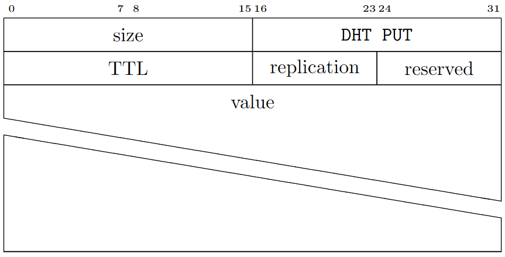

# FINAL REPORT

[TOC]

# What is a Distributed hash table (DHT)?
A distributed hash table (DHT) is a distributed storage for key-value pairs. An implementation of a DHT forms a structured overlay to optimize the placement and retrieval of the key-value pairs. Certain well established designs for DHT are the Chord, Pastry, Kademlia, and GNUnet’s R5N. Our implementation used the Chord algorithm. 

A DHT implementation supports storing a key-value pair and retrieval of the value given the corresponding key at any later point. The key-value pair can expire after a predefined timeout (TTL - Time to live). In our implementation, the keys are all 256 bit in length in accordance with the specification. To account for churn our implementation supports replication while storing a key-value pair.

*Distributed hash table*

# The Chord algorithm
Nodes and keys are assigned an $`m-bit`$ identifier using consistent hashing. The SHA-1 algorithm is the base hashing function for consistent hashing. Consistent hashing is integral to the robustness and performance of Chord because both keys and nodes (in fact, their IP addresses) are uniformly distributed in the same identifier space with a negligible possibility of collision. Thus, it also allows nodes to join and leave the network without disruption. In the protocol, the term node is used to refer to both a node itself and its identifier (ID) without ambiguity. So is the term key.

Using the Chord lookup protocol, nodes and keys are arranged in an identifier circle that has at most $`2^{m}`$ nodes, ranging from $`0`$ to $`2^m - 1`$. $`m`$ should be large enough to avoid collision.) Some of these nodes will map to machines or keys while others (most) will be empty.

Each node has a successor and a predecessor. The successor to a node is the next node in the identifier circle in a clockwise direction. The predecessor is counter-clockwise. If there is a node for each possible ID, the successor of node 0 is node 1, and the predecessor of node 0 is node $`2^m - 1`$; however, normally there are "holes" in the sequence. For example, the successor of node 153 may be node 167 (and nodes from 154 to 166 do not exist); in this case, the predecessor of node 167 will be node 153.

The concept of successor can be used for keys as well. The successor node of a key $`k`$ is the first node whose ID equals to $`k`$ or follows $`k`$ in the identifier circle, denoted by $`successor(k)`$. Every key is assigned to (stored at) its successor node, so looking up a key $`k`$ is to query $`successor(k)`$.

Since the successor (or predecessor) of a node may disappear from the network (because of failure or departure), each node records a whole segment of the circle adjacent to it, i.e., the $`r`$ nodes preceding it and the $`r`$ nodes following it. This list results in a high probability that a node is able to correctly locate its successor or predecessor, even if the network in question suffers from a high failure rate.

*Overview of chord algorithm*

## Protocol details 
<br>*The "fingers" for one of the nodes are highlighted in a 16-node ring.*

### Basic query
The core usage of the Chord protocol is to query a key from a client (generally a node as well), i.e. to find $`successor(k)`$. The basic approach is to pass the query to a node's successor, if it cannot find the key locally. This will lead to a $`O(N)`$ query time where $`N`$ is the number of machines in the ring.

### Finger table
To avoid the linear search above, Chord implements a faster search method by requiring each node to keep a finger table containing up to $`m`$ entries($`m`$ being the number of bits in the hash key). The $`i^{th}`$ entry of node $`n`$ will contain $`successor((n + 2^{i-1}) mod \enspace 2^m)`$. The first entry of finger table is actually the node's immediate successor (and therefore an extra successor field is not needed). Every time a node wants to look up a key $`k`$, it will pass the query to the closest successor or predecessor (depending on the finger table) of $`k`$ in its finger table (the "largest" one on the circle whose ID is smaller than $`k`$), until a node finds out the key is stored in its immediate successor.

With such a finger table, the number of nodes that must be contacted to find a successor in an N-node network is $`O(log N)`$.

### Node join
Whenever a new node joins, three invariants should be maintained (the first two ensure correctness and the last one keeps querying fast):

1. Each node's successor points to its immediate successor correctly.
1. Each key is stored in $`successor(k)`$.
1. Each node's finger table should be correct.

To satisfy these invariants, a predecessor field is maintained for each node. As the successor is the first entry of the finger table, we do not need to maintain this field separately any more. The following tasks are done for a newly joined node $`n`$:

1. Initialize node $`n`$ (the predecessor and the finger table).
1. Notify other nodes to update their predecessors and finger tables.
1. The new node takes over its responsible keys from its successor.

The predecessor of $`n`$ can be easily obtained from the predecessor of $`successor(n)`$ (in the previous circle). As for its finger table, there are various initialization methods. The simplest one is to execute find successor queries for all $`m`$ entries, resulting in $`O(M \enspace log N)`$ initialization time. A better method is to check whether $`i^{th}`$ entry in the finger table is still correct for the $`(i+1)^{th}`$ entry. This will lead to $`O(log^2 N)`$. The best method is to initialize the finger table from its immediate neighbours and make some updates, which is $`O(log N)`$.

### Stabilization
To ensure correct lookups, all successor pointers must be up to date. Therefore, a stabilization protocol is running periodically in the background which updates finger tables and successor pointers.

The stabilization protocol works as follows:

1. Stabilize(): n asks its successor for its predecessor p and decides whether p should be n‘s successor instead (this is the case if p recently joined the system).
1. Notify(): notifies n‘s successor of its existence, so it can change its predecessor to n
1. Fix_fingers(): updates finger tables

### Pseudocode
#### Definitions for pseudocode
1. finger[k] : first node that succeeds $`(n+2^{k-1}) \enspace mod \enspace 2^m, 1 \leq k \leq m`$
1. successor : the next node from the node in question on the identifier ring
1. predecessor : the previous node from the node in question on the identifier ring

#### 1. Find the successor node of an id
```
// ask node n to find the successor of id
n.find_successor(id)
    // Yes, that should be a closing square bracket to match the opening parenthesis.
    // It is a half closed interval.
    if id ∈ (n, successor] then
        return successor
    else
        // forward the query around the circle
        n0 := closest_preceding_node(id)
        return n0.find_successor(id)

// search the local table for the highest predecessor of id
n.closest_preceding_node(id)
    for i = m downto 1 do
        if (finger[i] ∈ (n, id)) then
            return finger[i]
    return n
```

#### 2. Stabilize the chord ring/circle after node joins and departures
```
// create a new Chord ring.
n.create()
    predecessor := nil
    successor := n

// join a Chord ring containing node n'.
n.join(n')
    predecessor := nil
    successor := n'.find_successor(n)

// called periodically. n asks the successor
// about its predecessor, verifies if n's immediate
// successor is consistent, and tells the successor about n
n.stabilize()
    x = successor.predecessor
    if x ∈ (n, successor) then
        successor := x
    successor.notify(n)

// n' thinks it might be our predecessor.
n.notify(n')
    if predecessor is nil or n'∈(predecessor, n) then
        predecessor := n'

// called periodically. refreshes finger table entries.
// next stores the index of the finger to fix
n.fix_fingers()
    next := next + 1
    if next > m then
        next := 1
    finger[next] := find_successor(n+{\displaystyle 2^{next-1}}2^{next-1});

// called periodically. checks whether predecessor has failed.
n.check_predecessor()
    if predecessor has failed then
        predecessor := nil
```


# The implementation
## Architecture of modules
The Project is separated into libraries, which speeds up compilation, makes unit testing easier, and reduces the risk of merge conflicts. Said libraries are:
- api
  - Responsible for inter-module communication.
  - Uses libasio for cross-platform networking.
- config
  - Uses inipp to parse the configuration file.
- dht
  - The actual distributed hash table.
  - Responsible for p2p communication, maintaining the finger table, and storing/retrieving data.
- entry
  - Starts the DHT
  - Offers a runtime shell to monitor the chord ring.
- logging
  - Has spdlog specific configuration files.
- rpc
  - Todo
- util
  - A collection of utility functions, as well as constants
- dht-4
  - The actual entrypoint of the program.
  - Parses command-line arguments and accoring to these calls entry module.

## Folder Structure
```
.
├── cmake
│   └── CPM.cmake
├── docs
├── src
│   ├── api
│   │   └── CMakeLists.txt
│   ├── config
│   │   └── CMakeLists.txt
│   ├── dht
│   │   └── CMakeLists.txt
│   ├── entry
│   │   └── CMakeLists.txt
│   ├── logging
│   │   └── CMakeLists.txt
│   ├── rpc
│   │   └── CMakeLists.txt
│   ├── util
│   │   └── CMakeLists.txt
│   ├── dht-4.cpp
│   └── CMakeLists.txt
├── test
│   └── CMakeLists.txt
├── CMakeLists.txt
├── config.ini
└── README.md
```

## Available libraries
These libraries are downloaded and updated using [cpm-cmake/CPM.cmake](https://github.com/cpm-cmake/CPM.cmake).
- [mcmtroffaes/inipp](https://github.com/mcmtroffaes/inipp) instead of inih
- [cap'n proto](https://capnproto.org/)
- [asio standalone](https://think-async.com/Asio/asio-1.18.2/doc/)
- [jarro2783/cxxopts](https://github.com/jarro2783/cxxopts)
- [gabime/spdlog](https://github.com/gabime/spdlog)
- [janbar/openssl-cmake](https://github.com/janbar/openssl-cmake)

## Logical structure
### API
Todo - API class diagram

The core of the api library is the `Api` class. It listens for incoming connections, and maintains a list of currently open connections. These connections then read and parse incoming requests, and pass those on to the appropriate `RequestHandler` (This depends on the message type). Those `RequestHandler`s are passed into the api from the outside.

### DHT
todo - DHT class diagram

The `Dht` class sets up the interface with the api by defining request handlers. The api now shares access to an instance of `NodeInformation` with the dht itself.  
`NodeInformation` stores the actual state of the node; including but not limited to:

- ip/port/id
- finger table
- predecessor
- the actual hash table to store data

The interface between peers is defined using a CapnProto schema, and the server-side of that is implemented in `PeerImpl`. This is where most of the actual dht logic takes place.

## Process architecture

The entire program takes place in one process, but using multithreading for asynchronicity. This is realized with `<future>` and `std::async`.
Most of the synchronized access happens within `NodeInformation`, which uses `std::shared_mutex`, `std::unique_lock`, and `std::shared_lock` for read-write locking. In some cases, a simple `std::atomic_bool` suffices.


## Networking
This project has two network interfaces: The Api for module-module communication using libasio standalone, and the Dht CapnProto interface for peer-peer communication, which uses (todo (explain tls rpc)). Also, capnproto has no (de)serialization of data, so any type of xss cannot occur. 

## Security measures
1. TLS security - todo

1. Proof of Work to protect against constant churn- 
   When a new node joins the network, it has to solve a Proof of Work puzzle supplied by the bootstrap node. The puzzle is different for each node and the difficulty of the puzzle can be set via a cmd argument.
   
   PoW protects against constant churn from disrupting the correct operation of the chord ring.

1. New DHT PUT & DHT GET message to maintain data integrity - 
   The new DHT PUT message accepts only the value and no key. The key to this data is sha256Hash(value). For retrieval of data the user supplies sha256Hash(value) to new DHT GET. The new DHT GET searches for sha256Hash(value). Upon retrieval, new DHT GET checks if sha256Hash(Retrieved value) == keyFromUser. This maintains data integrity.

1. Considering (public_key + IP + Port) for calculating Node ID to prevent ID mapping attack - 
   ID mapping attacks aim at nodes trying to manipulate their IDs to gain responsibility over data items they usually would not have. Future requests for data items under the malicious node's control can simply be ignored leading to DoS. This is protected against in our implementation by computing the Node ID as : 
   Node ID = sha256Hash(PublicKeyOfNewNode + IP + Port)

   There always exists the possibility that the attacker can generate multiple public-private key pairs or manipulate its IP and port. However, each new joinee has to solve the PoW puzzle. With a high difficulty for the PoW puzzle, it becomes very difficult to successfully execute a ID mapping attack.

1. Using a distrusted set to protect the network from malicious nodes - 
   todo (How does getSuccessor work in brief and how the distrust set protects against eclipse attacks) - 

## Peer to Peer protocol
### Message formats
The messages except DHT_PUT_KEY_IS_HASH_OF_DATA and DHT_GET_KEY_IS_HASH_OF_DATA are defined in the specification. DHT_PUT_KEY_IS_HASH_OF_DATA and DHT_GET_KEY_IS_HASH_OF_DATA are required to preserve data integrity and serve as an alternative to the traditional DHT_PUT and DHT_GET messages as explained in [Security Measures](#security-measures). As for the CapnProto Schema, all of the interface methods are required by the Chord algorithm.

#### DHT_PUT
---


#### DHT_GET
---


#### DHT_SUCCESS
---


#### DHT_FAILURE
---


#### DHT_PUT_KEY_IS_HASH_OF_DATA
---


#### DHT_GET_KEY_IS_HASH_OF_DATA
---


### Peer to peer communication
The Message schema for inter-peer communication is defined in ../src/dht/schemas/peer.capnp

### Constants
```yaml
DHT_PUT:     0x028a
DHT_GET:     0x028b
DHT_SUCCESS: 0x028c
DHT_FAILURE: 0x028d
DHT_PUT_KEY_IS_HASH_OF_DATA: 0x28e
DHT_GET_KEY_IS_HASH_OF_DATA: 0x28f
```

### Exception handling (Churn, connection breaks, corrupted data, ...)
Chord usually fixes itself in cases of Churn or Connection breaks. The only problem would be if a lot of nodes in the finger table suddenly go offline, but in that case the dht tries to re-join using the bootstrapping node. Corrupted data is dealt with in part by CapnProto, but since the underlaying protocol is TCP, we can assume to some extent that the data coming from the tcp layer is valid.
Also, the integrity of the stored data in the DHT can be maintained by using the DHT_PUT_KEY_IS_HASH_OF_DATA and DHT_GET_KEY_IS_HASH_OF_DATA messages as explained in [Security measures](#security-measures).

## Changes from implementation in midterm report
1. Hardened system against the attacks mentioned in [System security](#security-measures)
1. Changed hash function from SHA1 to sha256.
1. Implemented new DHT PUT and new DHT GET messaged to prevent data integrity.
1. Implemented logging using spdlog library
1. Implemented runtime shell for easy monitoring.
1. Changed getSuccessor mechanism - todo

## Known issues 
1. The network has currently been tested by spawning different nodes in a chord network on different ports of the localhost and testing the chord features. The system has not been tested in a real world network where two peers might be several hundred kilometers away. Testing the system with such a network might bring to light performance issues or new bugs.

## Future work
1. Rating system for nodes - 
   todo - 

1. Distrusted set currently empty at each call to getSuccessor(). These can be prefilled.
   todo - explain further

1. Caching - 
   No caching mechanism has been implemented currently. If nodes start caching frequently requested key-value pairs, RPC calls would not need to be made every request. This would hence improve performance.

# Setup & use
## How to install and run the software 
todo - 

## Command line arguments
1. -c, --config : Configuration file path
1. -h, --help : Print usage
1. -n, --node-amount : Create multiple nodes on localhost for testing. 0 means no nodes at all. Default is 1.
1. -l, --logMode : Set console log mode visibility (int): 0 - trace; 1 - debug; 2 - info; 3 - warning; 4 - error; 5 - critical; 6 - off and complete logs are present in ./async-log.txt
1. -o, --logOutput : Specify path for log file. Default: ./log.txt
1. -s, --startupScript : Specify path for startup script. The script should consist of commands which the runtime shell accepts.
1. -d, --POWdifficulty : Specify difficulty to be set for Proof of work algorithm. Usage: -d {NUMBER_OF_LEADING_ZEROES <= 160}
1. -r, --replicationLimit : Specify replication limit for the same data item on one node

## Runtime shell 
1. help
   - brief= "Print help for a command"
   - usage= "help [COMMAND]"
1. exit
   -  brief= "Exit the program"
   -  usage= "exit"
1. sleep
   -  brief= "Wait some time before accepting new input"
   -  usage= "sleep <SECONDS>"
1. repeat
   -  brief= "Repeat the previous command"
   -  usage= "repeat"
1. execute
   -  brief= "Execute a script"
   -  usage= "execute <PATH>"
1. add
   -  brief= "Add node to the chord ring"
   -  usage= "add [PORT]"
1. remove
   -  brief= "Remove node(s) from the chord ring"
   -  usage= "remove <INDEX> [COUNT]"
1. show
   1. show nodes
      -  brief= "List all Nodes, or information of one Node"
      -  usage= "show nodes [INDEX]"
   1. show data
      -  brief="List all data items contained in Node"
      -  usage="show nodes [INDEX]"
   1. show fingers
      -  brief= "Show finger table of a node"
      -  usage= "show fingers <INDEX>"

# References
1. [Stoica, I.; Morris, R.; Kaashoek, M. F.; Balakrishnan, H. (2001). "Chord: A scalable peer-to-peer lookup service for internet applications" (PDF). ACM SIGCOMM Computer Communication Review.](https://pdos.csail.mit.edu/papers/chord:sigcomm01/chord_sigcomm.pdf)
1. [Wikipedia](https://en.wikipedia.org/wiki/Chord_(peer-to-peer)) <br> We recognize that wikipedia isn't a trustworthy source of reference especially for academic papers. This is why all the information referenced from Wikipedia has been cross referenced with the other scientific papers mentioned here.
1. [Rescola - Intro to DHT](https://www.ietf.org/proceedings/65/slides/plenaryt-2.pdf)
1. [Security Considerations for Peer-to-Peer Distributed Hash Tables](https://citeseerx.ist.psu.edu/viewdoc/download?doi=10.1.1.11.7175&rep=rep1&type=pdf)

# Team - 
1. Maximilian Barmetler
1. Kumaravel Rajan

## Workload distribution 
todo

## Effort spent on project 
todo
