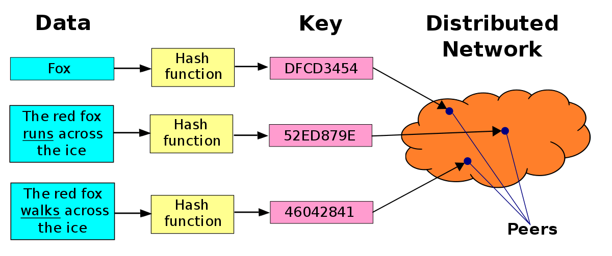

This is the final report for DHT-4 project.

[[_TOC_]]

# Overview

## What is a Distributed hash table (DHT)?
A distributed hash table (DHT) is a distributed storage for key-value pairs. An implementation of a DHT forms a structured overlay to optimize the placement and retrieval of the key-value pairs. Certain well established designs for DHT are the Chord, Pastry, Kademlia, and GNUnet’s R5N. Our implementation used the Chord algorithm. 

A DHT implementation supports storing a key-value pair and retrieval of the value given the corresponding key at any later point. The key-value pair can expire after a predefined timeout (TTL - Time to live). In our implementation, the keys are all 256 bit in length in accordance with the specification. To account for churn our implementation supports replication while storing a key-value pair.

## The Chord algorithm
