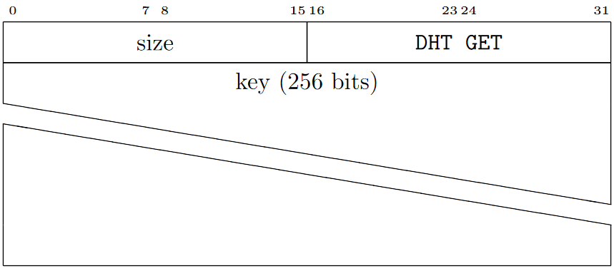
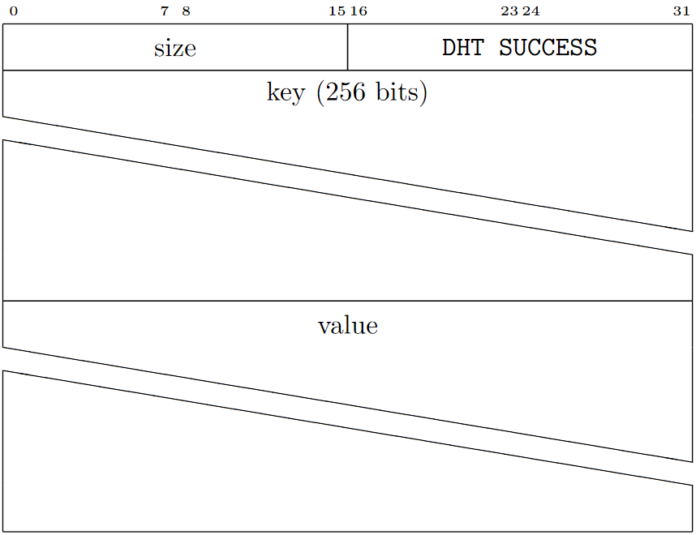

# Midterm report DHT-4
## Changes to assumptions in initial report
### Available libraries
These libraries are downloaded and updated using [cpm-cmake/CPM.cmake](https://github.com/cpm-cmake/CPM.cmake).
- [mcmtroffaes/inipp](https://github.com/mcmtroffaes/inipp) instead of inih
- [cap'n proto](https://capnproto.org/)
- [asio standalone](https://think-async.com/Asio/asio-1.18.2/doc/)
- [jarro2783/cxxopts](https://github.com/jarro2783/cxxopts)
- [gabime/spdlog](https://github.com/gabime/spdlog)
- [janbar/openssl-cmake](https://github.com/janbar/openssl-cmake)

---
## Architecture of modules
The Project is separated into libraries, which speeds up compilation, makes unit testing easier, and reduces the risk of merge conflicts. Said libraries are:
- api
  - Responsible for inter-module communication.
  - Uses libasio for cross-platform networking.
- config
  - Uses inipp to parse the configuration file.
- dht
  - The actual distributed hash table.
  - Responsible for p2p communication, maintaining the finger table, and storing/retrieving data.
- util
  - A collection of utility functions, as well as constants
- dht-4
  - The actual entrypoint of the program.
  - Parses command-line arguments, starts the DHT, and offers a command-line interface using stdin/stdout.

### Folder Structure
```
.
├── cmake
│   └── CPM.cmake
├── docs
├── src
│   ├── api
│   │   └── CMakeLists.txt
│   ├── config
│   │   └── CMakeLists.txt
│   ├── dht
│   │   └── CMakeLists.txt
│   ├── util
│   │   └── CMakeLists.txt
│   ├── dht-4.cpp
│   └── CMakeLists.txt
├── test
│   └── CMakeLists.txt
├── CMakeLists.txt
├── config.ini
└── README.md
```

---
### Logical structure
#### API


The core of the api library is the `Api` class. It listens for incoming connections, and maintains a list currently open connections. These connections then read and parse incoming requests, and pass those on to the appropriate `RequestHandler` (This depends on the message type). Those `RequestHandler`s are passed into the api from the outside.

#### DHT


The `Dht` class sets up the interface with the api by defining request handlers. The api now shares access to an instance of `NodeInformation` with the dht itself.  
`NodeInformation` stores the actual state of the node; including but not limited to:

- ip/port/id
- finger table
- predecessor
- the actual hash table to store data

The interface between peers is defined using a CapnProto schema, and the server-side of that is implemented in `PeerImpl`. This is where most of the actual dht logic takes place.

---
### Process architecture
The entire program takes place in one process, but using multithreading for asynchronicity. This is realized with `<future>` and `std::async`.
Most of the synchronized access happens within `NodeInformation`, which uses `std::shared_mutex`, `std::unique_lock`, and `std::shared_lock` for read-write locking. In some cases, a simple `std::atomic_bool` suffices.

---
### Networking
This project has two network interfaces: The Api for module-module communication using libasio standalone, and the Dht CapnProto interface for peer-peer communication, which uses ez-rpc for now.

---
### Security measures
Right now, there are no security measures apart from the ones supplied by CapnProto, which includes the following:

- There can be no malicious payloads in the peer-to-peer messages, since CapnProto does not parse anything. The bytes come as they are and are read as raw data directly.
- Only the pre-defined interface methods can be called from a peer, and all of them can assume the peer to be malicious.
- There is no malicious intent expected on the api side of things, but it would make sense to only allow incoming requests from the same device the dht runs on, as the api is meant for inter-process communication. This can be achieved with a firewall, however.

---
## The peer-to-peer protocol that is present in the implementation
### Message formats

#### DHT PUT


#### DHT GET


#### DHT SUCCESS


#### DHT FAILURE


#### Peer to peer communication
The Message schema for inter-peer communication is defined in [../src/dht/schemas/peer.capnp](../src/dht/schemas/peer.capnp)

#### Constants
```yaml
DHT PUT:     0x028a
DHT GET:     0x028b
DHT SUCCESS: 0x028c
DHT FAILURE: 0x028d
```

### Reasoning why the messages are needed
The messages are defined in the specification. As for the CapnProto Schema, all of the interface methods are required by the Chord algorithm.

---
### Exception handling (Churn, connection breaks, corrupted data, ...)
Chord usually fixes itself in cases of Churn or Connection breaks. The only problem would be if a lot of nodes in the finger table suddenly go offline, but in that case the dht tries to re-join using the bootstrapping node. Corrupted data is dealt with in part by CapnProto, but since the underlaying protocol is TCP, we can assume to some extent that the data coming from the tcp layer is valid.

---
## Future Work
- The DHT is currently in the testing and bugfixing phase, which still poses a lot of work.
- A more advanced logging system (spdlog)
- A runtime shell for changing settings and getting information while the dht is running
- CapnProto allows you to use any underlying networking layer that you want, so encryption is possible. This requires a custom implemention of the Client and Server classes, because ez-rpc does not allow much configuration (as the name implies).
- There are many different dht-specific attacks that we are yet to harden against.
- Performance Testing.
- TCP uses a 16 bit checksum, and there is a 32 bit Frame Check Sequence in the Ethernet layer. It would make sense to add our own crc on top of tcp, if it is at least 48 bits or so, which we might look into at some point in the future.
- Also, since this error checking is essentially part of the Presentation Layer, it has a tighter set of rules to follow and could be potentially more powerful, at least in the error detection department. (If the requested data is an ip address, is the response actually a valid one? etc.)
- This is also important, because corrupted data can not only be caused by transmission errors, but because it is unknown whether the source of the data is trustworthy. It can be intentionally incorrect data to destabilize the dht.

---
## Workload Distribution — Who did what
- Maxi Barmetler
  - CMake Project and Library Selection
  - Api to let other Modules interface with the Dht
  - Dht Logic
  - Networking and Thread Management
- Kumaravel Rajan
  - Gitlab Issues for Workload Planning and Distribution
  - Parse Configuration File and Command-line Arguments
  - Dht Logic
  - Main Entry Point

---
## Effort spent for the project (please specify individual effort)

- Maxi Barmetler
  - At first about 15hrs/week, but project setup and boilerplate code is more time-consuming than complicated
  - Then between 5 and 10hrs/week, excluding time spent on research
- Kumaravel Rajan
  - // TODO
---


<style>
img {
  width: min(45em, 95vw);
}
h3, h4 {
  font-weight: bold;
}
</style>
